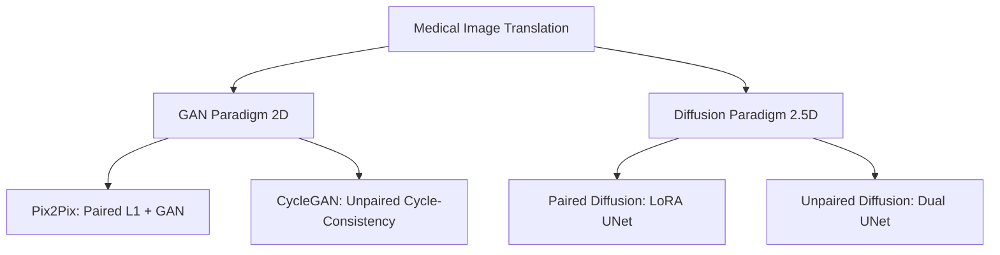

# Comparative Summary of 8 Canonical Medical Translation Models

## Overview
This document synthesizes the architectural paradigms, training strategies, and comparative strengths of the 8 canonical deep learning pipelines developed for CT-to-MRI image translation. The models span two anatomical regions (Brain and Pelvis) and represent four distinct architectural families:
1. **Paired Diffusion** (Brain & Pelvis)
2. **Unpaired Diffusion** (Brain & Pelvis)
3. **Pix2Pix** (Brain & Pelvis)
4. **CycleGAN** (Brain & Pelvis)

---

## 1. Architectural Taxonomy

---

## 2. Architectural Families: Diffusion vs. GANs

### The Diffusion Paradigm (Paired & Unpaired Diffusion)
- **Base Architecture**: Latent Diffusion Models (LDMs), specifically leveraging pre-trained `stabilityai/sd-turbo` base weights.
- **Dimensionality**: **2.5D**. Inputs are processed as 3 adjacent 2D slices (stacked into 3 channels). This provides crucial volumetric context without the severe memory constraints of full 3D convolutions.
- **Efficiency Mechanism**: LoRA (Low-Rank Adaptation) is applied to the UNet, freezing the massive base model and only training lightweight adapters.
- **Inference Speed**: 1-step generation. The use of SD-Turbo entirely bypasses the traditional slow iterative denoising process of diffusion models, yielding speeds comparable to GANs.
- **Key Innovation**: **VAE Skip Connections**. Standard VAEs aggressively compress data, causing a loss of high-frequency structural detail (which is clinically unacceptable). These diffusion pipelines cache encoder activations and inject them into the decoder via skip convolutions, preserving razor-sharp anatomical edges.

### The GAN Paradigm (Pix2Pix & CycleGAN)
- **Base Architecture**: Standard Convolutional Neural Networks (CNNs).
- **Dimensionality**: **2D**. Processes slices completely independently. Cannot perceive Z-axis depth, sometimes leading to slice-to-slice flickering in 3D reconstructions.
- **Generator Types**: 
  - *Pix2Pix* uses a `U-Net Generator` with bottleneck skip connections.
  - *CycleGAN* uses a `ResNet Generator` (9 blocks), specifically designed to preserve structural identity through deep layers.
- **Discriminator Type**: Both use **PatchGAN** discriminators. Instead of classifying the whole image as Real/Fake, PatchGAN classifies N×N local patches, heavily penalizing blurry textures and enforcing sharp local details.

---

## 2. Modality Constraints: Paired vs. Unpaired

### Paired Translation (Paired Diffusion & Pix2Pix)
- **Data Requirement**: Requires perfectly registered (spatially aligned) CT and MRI pairs for the exact same patient.
- **Loss Mechanisms**: Heavily reliant on direct **L1 Loss** (Mean Absolute Error) to force pixel-perfect similarity between the generated image and the ground-truth target.
- **Complexity**: Simpler to train. Only requires one forward mapping (CT → MRI).
- **Clinical Implication**: Highly accurate and strictly enforces anatomical fidelity, but creating perfectly registered medical datasets is extremely difficult and expensive due to patient movement and varying acquisition times.

### Unpaired Translation (Unpaired Diffusion & CycleGAN)
- **Data Requirement**: Utilizes completely unpaired, unaligned datasets. It learns the *distribution* mapping rather than a direct patient-to-patient mapping.
- **Loss Mechanisms**: 
  - **Cycle-Consistency Loss**: $CT \rightarrow Fake MRI \rightarrow Reconstructed CT$. The reconstructed CT must match the original CT.
  - **Identity Loss**: Passing a real MRI into the CT→MRI network should output the exact same MRI.
- **Complexity**: Highly complex. Requires simultaneous training of two mappings (A→B and B→A), doubling the number of networks (2 Generators/VAEs, 2 Discriminators) and significantly increasing VRAM usage.
- **Clinical Implication**: Extremely versatile as it can leverage vast amounts of unaligned clinical data. However, it is prone to GAN "hallucinations" (inventing or deleting structures to satisfy cycle consistency).

---

## 3. Regional Differences: Brain vs. Pelvis
Across all 4 architectural families, the models for Brain and Pelvis are structurally identical. The codebases share the exact same neural network definitions, data ingestion logic, and training loops. The distinguishing factors are:
1. **Target Data Distribution**: The models map to completely different tissue densities and anatomical structures. 
2. **Configuration Values**: Specific hyperparameter defaults (e.g., specific Hounsfield Unit clamping ranges for CT data) are occasionally tailored to the region within the `.env` or configuration files.

---

## 4. Tabular Summary

| Feature | Paired Diffusion | Unpaired Diffusion | Pix2Pix | CycleGAN |
| :--- | :--- | :--- | :--- | :--- |
| **Model Type** | Latent Diffusion (SD-Turbo) | Cycle-Latent Diffusion (SD-Turbo)| Conditional GAN | Cycle-Consistent GAN |
| **Data Requirement** | Perfectly Paired | Completely Unpaired | Perfectly Paired | Completely Unpaired |
| **Spatial Dim.** | **2.5D** (3 slices = 3 channels) | **2.5D** (3 slices = 3 channels) | **2D** (Single slice) | **2D** (Single slice) |
| **Generator / Core** | LoRA-tuned UNet + VAE | Shared UNet + Dual VAEs | U-Net CNN | ResNet-9 CNN |
| **Discriminator** | Vision-Aided GAN (CLIP) | Dual Vision-Aided GANs | PatchGAN | Dual PatchGANs |
| **Key Losses** | GAN, L1, LPIPS | Cycle, Identity, Dual GAN, LPIPS| GAN (LSGAN), L1 | Cycle, Identity, Dual GAN |
| **Structural Pres.** | VAE Skip Connections | VAE Skip Connections | U-Net Skip Connections | ResNet Bottlenecks |
| **Inference** | 1-Step Denoise (Fast) | 1-Step Denoise (Fast) | Direct Feedforward (Fast) | Direct Feedforward (Fast) |
| **Primary Strength** | Extreme fidelity, texture quality | Versatility + texture quality | Training stability, simplicity | Unpaired capability, speed |
| **Primary Risk**| VAE blurring (mitigated by skips) | Complex hyperparameter tuning | Blurry textures, 2D artifacts | Hallucinations, 2D artifacts |
