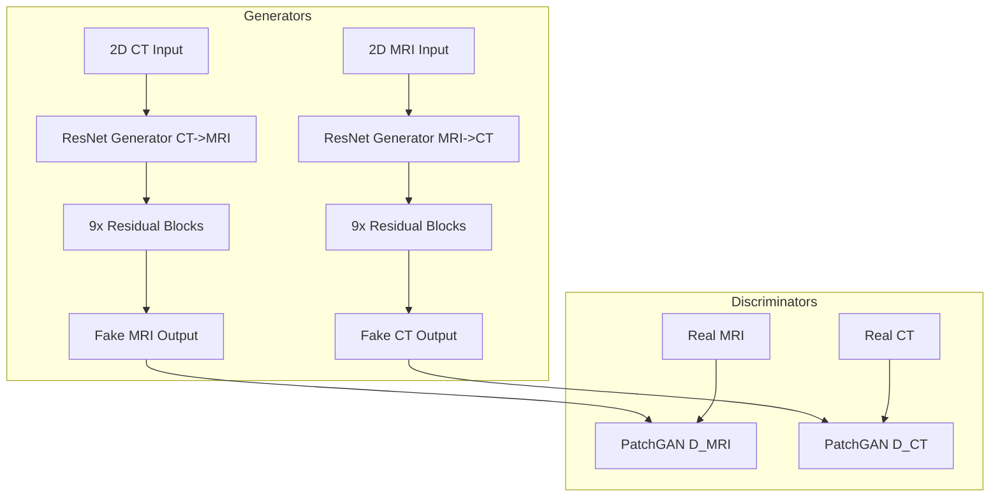
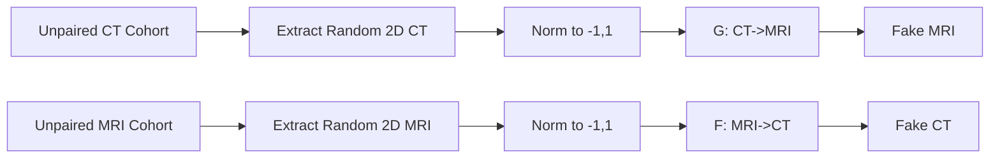
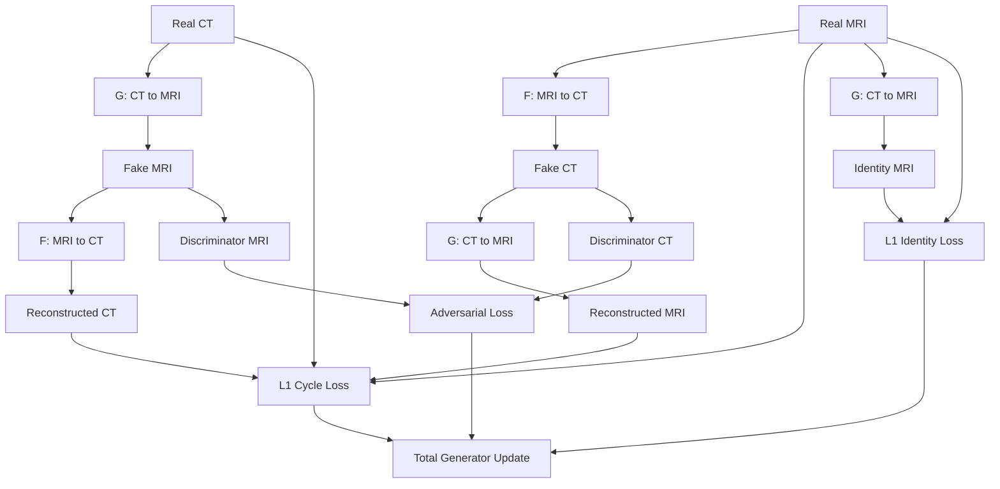
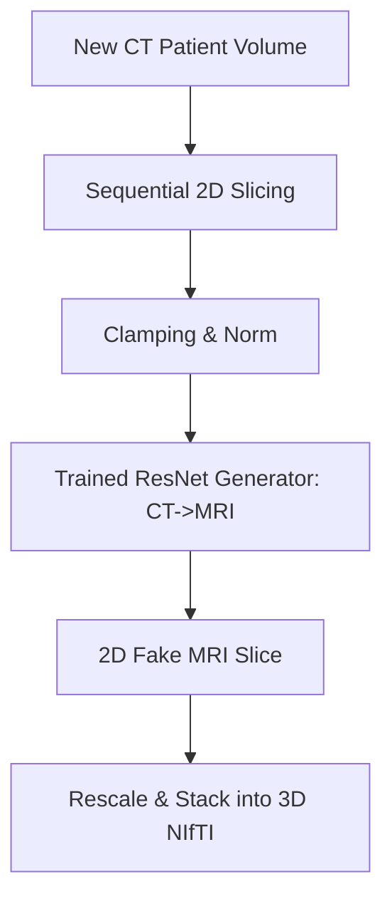

# CycleGAN (Brain) Documentation

## Basic Information
- **Model Name**: CycleGAN (Brain)
- **Pipeline Path**: `project-group-5/models/cyclegan/brain`
- **Architecture Type**: Cycle-Consistent Generative Adversarial Network (CycleGAN)
- **Region**: Brain
- **Modality**: Unpaired (CT ↔ MRI)
- **Purpose**: Bidirectional, unsupervised translation between brain CT and MRI slices using cycle consistency to circumvent the need for perfectly aligned training pairs.

## Technical Documentation

### High-Level Architecture Overview
This pipeline implements the CycleGAN framework, specifically optimized for 2D medical imaging. It learns two mappings simultaneously: G: CT → MRI and F: MRI → CT. To ensure the mappings are structurally meaningful rather than random style transfers, it enforces "cycle consistency" (i.e., translating CT to MRI and back should yield the original CT).
The system relies on ResNet-based generators rather than standard U-Nets, utilizing residual blocks to preserve spatial information through the network bottleneck.

### Layer-by-Layer Breakdown
1. **Input Representation (2D)**: Operates on 2D slices extracted on the fly from 3D volumes (via `.pt` or `.nii` files). Interpolated to a strict 256x256 square, forming a single-channel `[1, 256, 256]` input.
2. **Generators (`ResnetGenerator` / `Generator2D`)**: 
   - Consists of a downsampling encoder, a series of 9 residual blocks (for 256x256 resolution), and an upsampling decoder.
   - ResNet blocks prevent the vanishing gradient problem and allow deep networks to perfectly retain input identity where necessary.
   - Optionally incorporates Self-Attention mechanisms (`use_attention=True`) to capture long-range spatial dependencies.
3. **Discriminators (`Discriminator2D` / `MultiScaleDiscriminator`)**:
   - Employs a PatchGAN architecture to penalize local texture/style rather than a single global scalar.
   - Can optionally utilize a `MultiScaleDiscriminator` which evaluates the image at multiple resolutions (e.g., original and downsampled by half) to improve both global structure and local detail.

### Training Workflow
- The model trains using independent, unpaired sets of CT and MRI 2D slices.
- Uses an `ImagePool` (replay buffer) of size 50 to store previously generated fakes, preventing the discriminator from oscillating and stabilizing GAN training.
- **Losses**: 
  - **Adversarial Loss (LSGAN)**: Pushes generators to produce realistic slices that fool the discriminators.
  - **Cycle-Consistency Loss**: Uses `L1 Loss` (`lambda_cycle=10.0`) to ensure $F(G(CT)) \approx CT$ and $G(F(MRI)) \approx MRI$.
  - **Identity Loss**: Uses `L1 Loss` (`lambda_identity=0.5 * lambda_cycle`) to ensure that feeding a real MRI into the CT→MRI generator produces the exact same MRI without altering it.
  - **Perceptual Loss**: Optionally adds an `LPIPS` penalty to the cycle consistency to ensure perceptual features match.
- **Optimizers**: Two Adam optimizers (one for both Generators, one for both Discriminators).
- **Learning Rate Scheduler**: Linear decay scheduler; constant for the first `n_epochs`, linearly decaying to 0 over the next `n_epochs_decay`.

### Inference Workflow
- A 2D CT slice is passed through the CT→MRI generator (`G_CT2MRI`).
- The network directly outputs a synthesized 2D MRI slice.
- For complete volumes, sequential 2D slices are processed and stacked.

### Dataset & Preprocessing
- **Data Loading**: On-the-fly random 2D slice extraction. Shuffles CT and MRI indices independently to break any accidental pairing.
- **Normalization**: strict min-max scaling normalizes pixel values of both CT and MRI to `[-1, 1]`. CT values are usually clamped to a specific Hounsfield Unit range prior to normalization.

### Advantages
- Completely eliminates the need for spatially registered datasets, allowing the use of large, unaligned clinical cohorts.
- The ResNet architecture is highly effective at preserving high-frequency details across translations.
- Identity loss perfectly preserves background regions (air/space).

### Limitations
- Inherently 2D; does not enforce coherence between adjacent slices in the Z-axis, which can lead to flickering artifacts when volumes are viewed sagittally or coronally.
- CycleGANs are prone to "hallucinating" or hiding structures (e.g., tumors) because the network learns to hide information in high-frequency noise to satisfy the cycle-consistency loss without actually rendering it visibly.
- Training is slow and computationally expensive due to having 4 networks (2 Generators, 2 Discriminators) executing forward/backward passes.

## Required Diagrams

### 1. Architecture Diagram

### 2. Data Flow Diagram

### 3. Training Pipeline Flowchart

### 4. Inference Pipeline Flowchart

