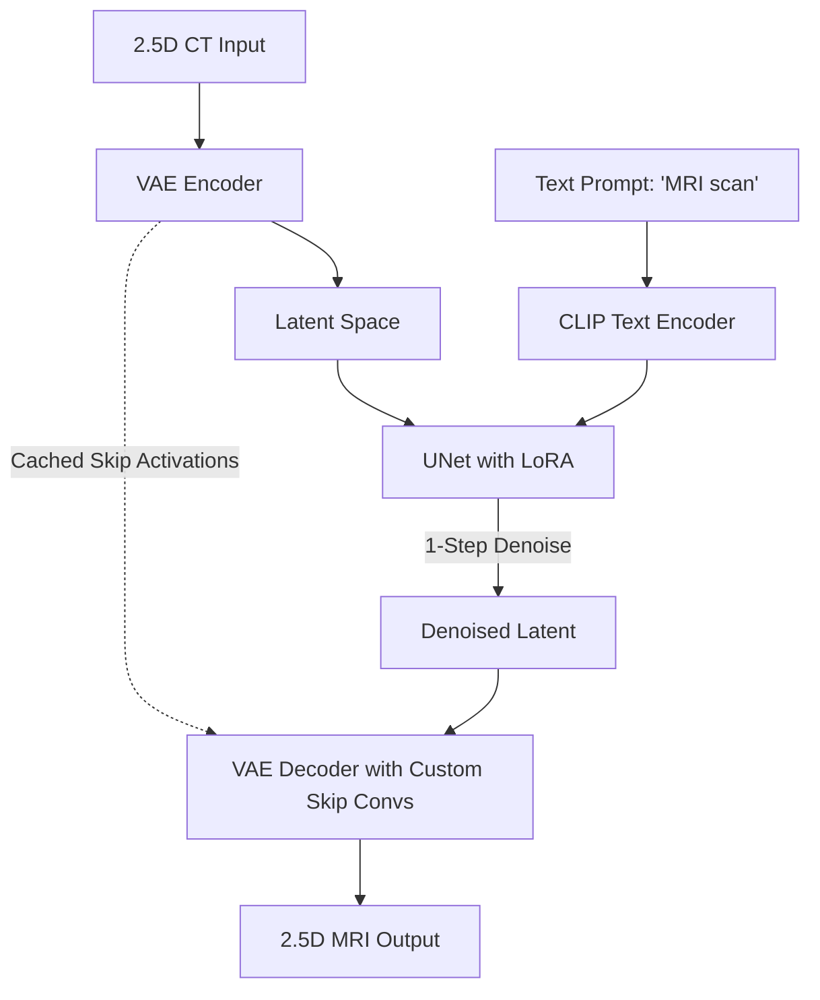
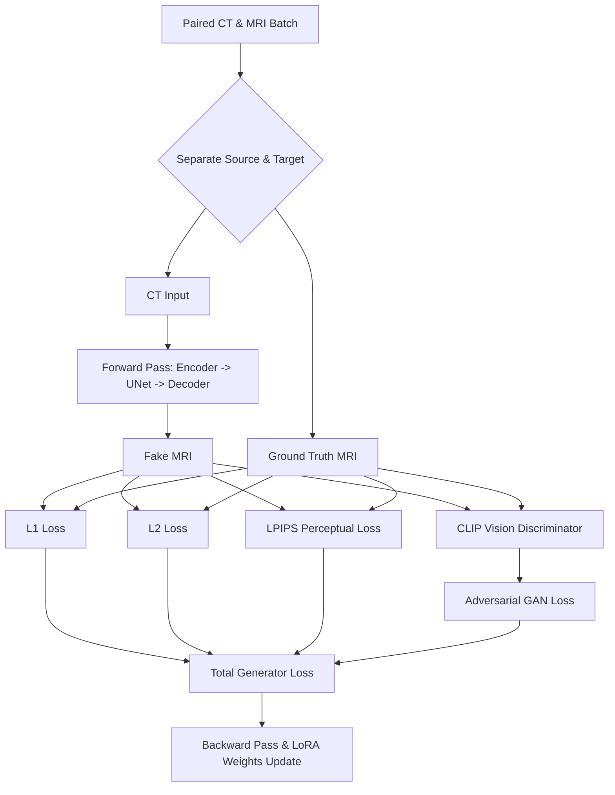
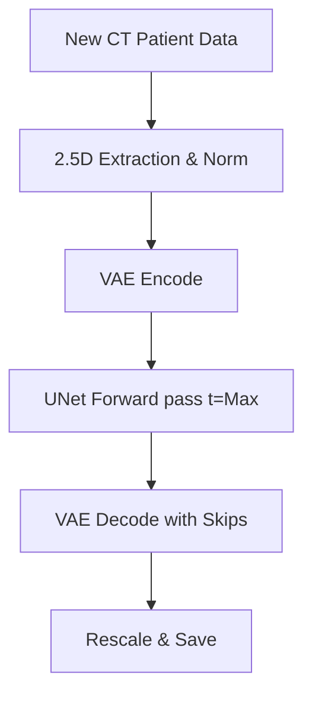

# Paired Diffusion (Brain) Documentation

## Basic Information
- **Model Name**: Paired Diffusion (Brain)
- **Pipeline Path**: `project-group-5/models/paired_diffusion/brain`
- **Architecture Type**: Latent Diffusion Model (1-Step Translation) with LoRA and VAE Skip Connections
- **Region**: Brain
- **Modality**: Paired (CT to MRI)
- **Purpose**: Directly map brain CT scans to brain MRI scans using a pre-trained single-step diffusion model (SD-Turbo) fine-tuned on paired medical data.

## Technical Documentation

### High-Level Architecture Overview
The model leverages a pre-trained Latent Diffusion Model (`stabilityai/sd-turbo`), heavily adapted for 2.5D medical image translation. Unlike standard multi-step diffusion models, this pipeline uses a **1-step DDPMScheduler**, enabling fast, single-step generation from a latent representation. 
To preserve structural fidelity—crucial in medical imaging—the pipeline introduces skip connections linking the VAE Encoder directly to the VAE Decoder. Fine-tuning is performed efficiently using Low-Rank Adaptation (LoRA) on both the UNet and the VAE components, while the base weights remain frozen.

### Layer-by-Layer Breakdown
1. **Input Representation (2.5D)**: The model processes inputs as 2.5D. It takes 3 adjacent axial 2D slices and maps them to the 3 input channels (simulating RGB) expected by the base model.
2. **VAE Encoder (`VAEEncode`)**: The pre-trained AutoencoderKL maps the 3-channel CT input into a compressed latent space. During this pass, intermediate activations (`down_blocks`) are cached.
3. **UNet Denoising (`UNet2DConditionModel`)**: The UNet operates on the latents. It is conditioned via cross-attention on a textual prompt embedding (e.g., "MRI scan") encoded by a frozen CLIPTextModel. LoRA adapters (`default` adapter) are injected into attention matrices and convolutional layers. Since it's an SD-Turbo base, the network predicts the fully denoised latent in a single timestep (`t = num_train_timesteps - 1`).
4. **VAE Decoder (`VAEDecode`)**: The denoised latents are projected back to the image space. Custom `skip_conv` layers fuse the cached VAE Encoder activations directly into the VAE Decoder's upsampling blocks, bypassing the UNet bottleneck to retain high-frequency anatomical edges.

### Training Workflow
- The model is trained using paired CT-MRI slices. 
- A fixed timestep corresponding to the maximum noise level is passed to the UNet.
- **Losses**: 
  - **Reconstruction**: `L1 Loss` (Mean Absolute Error) + `L2 Loss` (Mean Squared Error).
  - **Perceptual**: `LPIPS` loss using a VGG network to ensure perceptual realism.
  - **Adversarial**: An optional Vision-Aided GAN loss (`vagan_clip`) can be enabled (`lambda_gan > 0`) to penalize the generated outputs using a frozen CLIP-based discriminator.
- **Optimizer**: AdamW optimizer for generator (LoRA params + custom VAE skip convolutions) and discriminator.
- **Gradient Accumulation & Precision**: Supports mixed-precision (FP16/BF16), gradient checkpointing, and xFormers for memory efficiency.

### Inference Workflow
- Inference mirrors training. A 2.5D CT tensor is encoded, passed through the UNet with the target text prompt, and decoded.
- Only a single scheduler step is required.
- Outputs are bounded and normalized strictly to the `[-1, 1]` range.

### Dataset & Preprocessing
- **Data Loading**: Expects `.pt` tensors or image files. `.pt` arrays are sliced to extract a 3-channel 2.5D volume.
- **Transformations**: Images are resized/padded to a strict uniform square (e.g., 256x256). 
- **Normalization**: strict min-max scaling normalizes pixel values to `[-1, 1]`.

### Advantages
- Extremely fast inference due to 1-step SD-Turbo architecture.
- VAE skip-connections prevent the typical blurring caused by the VAE bottleneck, preserving critical medical structures.
- Parameter-efficient fine-tuning (LoRA) reduces VRAM requirements.

### Limitations
- Inherently 2.5D; lacks true 3D volumetric context across the entire z-axis.
- Single-step generation may hallucinate textures if the base prior is too strong and the paired constraints are weakly weighted.
- Requires perfectly paired data for the reconstruction losses (L1, L2, LPIPS) to function properly.

## Required Diagrams

### 1. Architecture Diagram

### 2. Data Flow Diagram

### 3. Training Pipeline Flowchart

### 4. Inference Pipeline Flowchart

