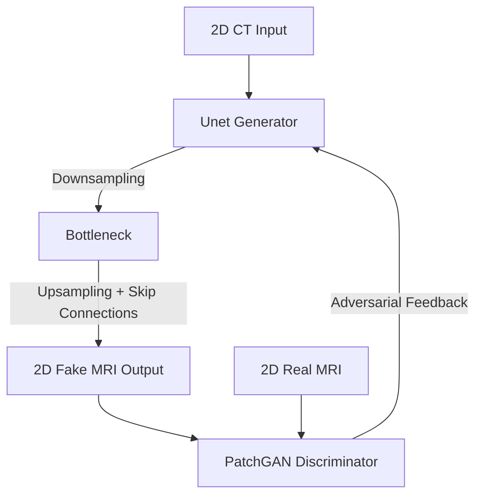
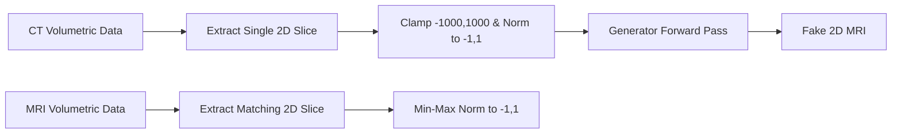
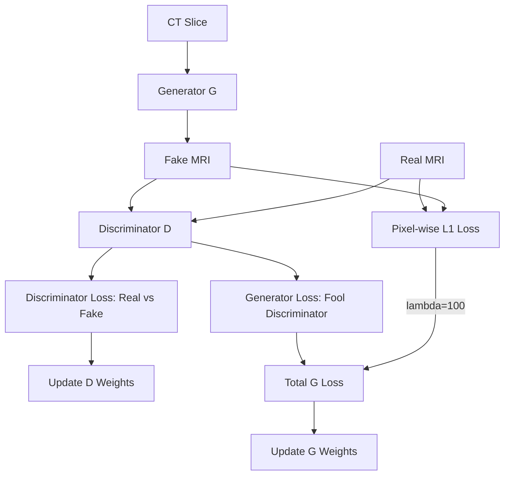
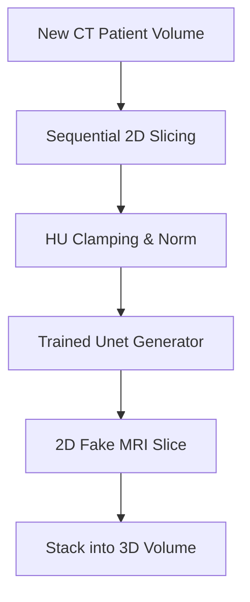

# Pix2Pix (Brain) Documentation

## Basic Information
- **Model Name**: Pix2Pix (Brain)
- **Pipeline Path**: `project-group-5/models/pix2pix/brain`
- **Architecture Type**: Conditional Generative Adversarial Network (cGAN)
- **Region**: Brain
- **Modality**: Paired (CT to MRI)
- **Purpose**: Direct, deterministic translation of 2D brain CT slices into corresponding 2D MRI slices using a paired U-Net Generator and PatchGAN Discriminator setup.

## Technical Documentation

### High-Level Architecture Overview
This pipeline implements the classic Pix2Pix architecture, adapted for 2D medical image translation. It is built entirely on standard Convolutional Neural Networks (CNNs) without any latent diffusion processes.
The architecture consists of a `UnetGenerator` that directly maps a source CT slice to a target MRI slice, and an `NLayerDiscriminator` (PatchGAN) that evaluates whether a given MRI slice is real or generated, conditioned implicitly on the task.

### Layer-by-Layer Breakdown
1. **Input Representation (2D)**: Slices are extracted on the fly from 3D volumetric tensors (`.pt` files) along a specified axis (e.g., axial). Slices are interpolated to 256x256. The input to the model is a strict 2D single-channel tensor (`[1, 256, 256]`).
2. **Generator (`UnetGenerator`)**: 
   - Uses an encoder-decoder architecture with explicit skip connections between mirrored layers (U-Net structure).
   - Downsampling occurs via convolutional layers (e.g., to a bottleneck of 1x1).
   - Upsampling reconstructs the spatial dimensions.
   - Skip connections concatenate the high-frequency spatial features from the encoder directly into the decoder, preventing blurring.
   - Dropout is utilized in the decoder to induce slight stochasticity and prevent overfitting.
3. **Discriminator (`NLayerDiscriminator`)**:
   - A standard PatchGAN architecture.
   - Instead of outputting a single scalar (Real/Fake) for the entire image, it maps the input to an N x N array of outputs (e.g., 30x30 patches).
   - This penalizes structure at the scale of local image patches, promoting sharper image generation.

### Training Workflow
- The model trains using perfectly paired CT and MRI 2D slices.
- The Generator and Discriminator are trained in alternating steps.
- **Losses**: 
  - **Generator Loss**: Combines an Adversarial Loss (LSGAN / Mean Squared Error) pushing the Discriminator to classify fakes as real, and an `L1 Loss` (`lambda_l1=100.0`) forcing pixel-wise similarity between the generated MRI and the ground truth MRI. 
  - **Discriminator Loss**: Standard Adversarial Loss (LSGAN) distinguishing between Real MRI and Fake MRI.
- **Optimizer**: Two Adam optimizers (one for Generator, one for Discriminator).
- **Learning Rate Scheduler**: Linear decay scheduler that keeps the LR constant for `n_epochs` and then linearly decays it to 0 over `n_epochs_decay`.

### Inference Workflow
- A 2D CT slice is extracted from the patient's volume.
- Passed directly through the trained `UnetGenerator`.
- The output 2D slice is rescaled from `[-1, 1]` to the target MRI intensity range.

### Dataset & Preprocessing
- **Data Loading**: On-the-fly random 2D slice extraction from 3D `.pt` volumes (`SynthRADDataset`).
- **Normalization**: 
   - CT images: Clamped to Hounsfield Unit (HU) range `[-1000, 1000]`, then mapped to `[-1, 1]`.
   - MRI images: Robust Min-Max normalized to `[-1, 1]`.

### Advantages
- Extremely fast training and inference compared to Diffusion models.
- U-Net skip connections force structural alignment, preventing the network from inventing anatomy that doesn't exist in the source CT.
- Lower VRAM footprint.

### Limitations
- Inherently 2D processing; totally lacks contextual awareness across the Z-axis (slices are processed entirely independently).
- Often produces slightly blurrier or "washed out" textures compared to Diffusion models.
- Susceptible to mode collapse or training instability inherent to GANs, though mitigated by the strong L1 constraint.

## Required Diagrams

### 1. Architecture Diagram

### 2. Data Flow Diagram

### 3. Training Pipeline Flowchart

### 4. Inference Pipeline Flowchart

