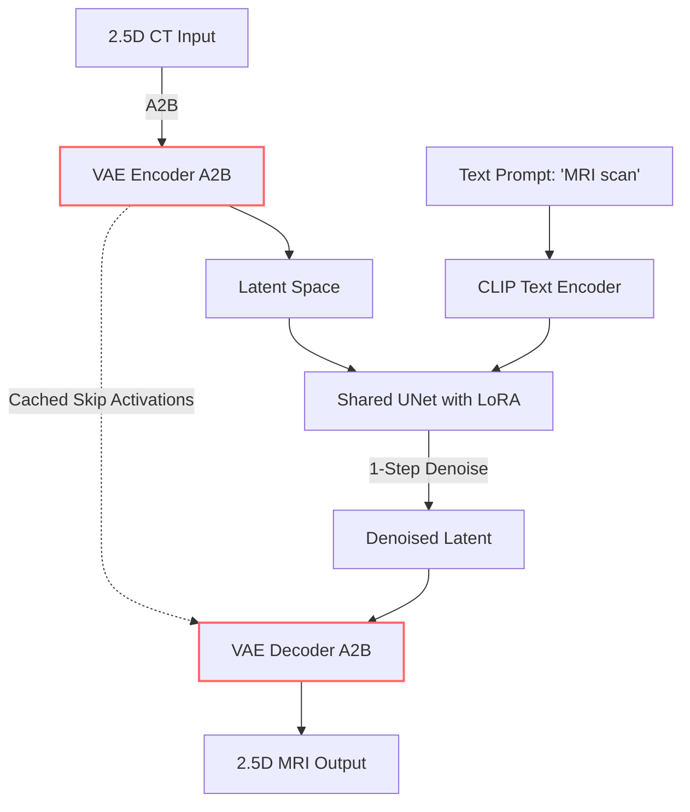
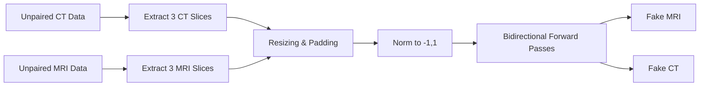
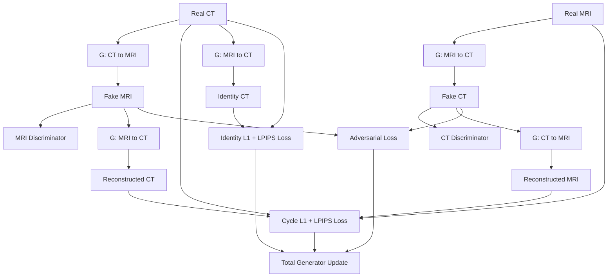
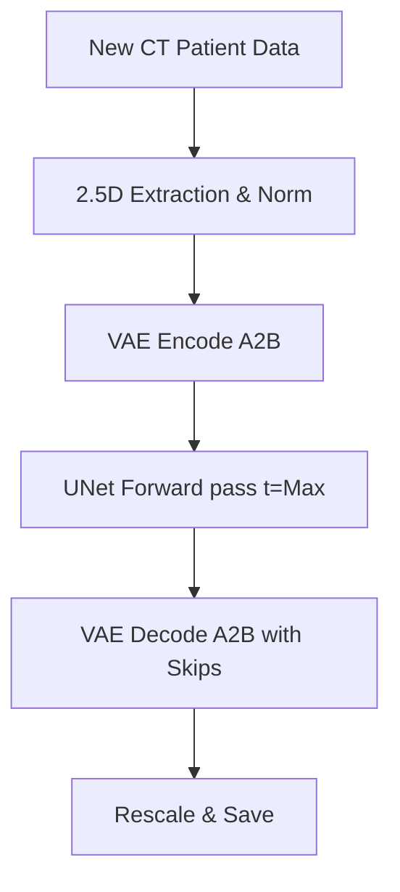

# Unpaired Diffusion (Brain) Documentation

## Basic Information
- **Model Name**: Unpaired Diffusion (Brain)
- **Pipeline Path**: `project-group-5/models/unpaired_diffusion/brain`
- **Architecture Type**: Bidirectional Cycle-Consistent Latent Diffusion Model
- **Region**: Brain
- **Modality**: Unpaired (CT ↔ MRI)
- **Purpose**: Map brain CT scans to MRI scans (and vice versa) using a pre-trained single-step diffusion model (SD-Turbo), trained on unpaired datasets via cycle-consistency.

## Technical Documentation

### High-Level Architecture Overview
This pipeline adapts the single-step Latent Diffusion Model (`stabilityai/sd-turbo`) for unsupervised domain translation, inspired by CycleGAN. Since the dataset is unpaired, the model learns a bidirectional mapping (Domain A to Domain B, and Domain B to Domain A). 
It employs a shared UNet structure but initializes two separate sets of VAEs (`vae_a2b` and `vae_b2a`) to handle the unique latent projections of each modality. Skip connections are utilized in the VAEs to preserve structural details. The entire framework is fine-tuned using LoRA adapters.

### Layer-by-Layer Breakdown
1. **Input Representation (2.5D)**: Takes 3 adjacent axial 2D slices to form a 3-channel input tensor representing a 2.5D volume.
2. **Bidirectional VAE Encoders (`VAEEncode`)**: The system contains domain-specific encoding paths (`vae_a2b` and `vae_b2a`). A CT image is encoded using the A→B encoder to project it into a shared latent space. Intermediate activations are cached.
3. **Shared UNet Denoising (`UNet2DConditionModel`)**: A single UNet, fine-tuned with LoRA, processes latents for both translation directions. It conditions on text prompts (e.g., "MRI scan" or "CT scan") using a frozen CLIP text encoder to guide the domain shift. The generation occurs in a single timestep (`t = num_train_timesteps - 1`).
4. **Bidirectional VAE Decoders (`VAEDecode`)**: The denoised latents are projected back to the target image space using the appropriate target domain decoder. Cached activations from the respective encoder are fused via `skip_conv` layers to restore high-frequency anatomical features.

### Training Workflow
- The model takes independent, unpaired batches of CT and MRI slices.
- The forward pass executes translations in both directions simultaneously (Fake MRI and Fake CT).
- **Losses**: 
  - **Cycle-Consistency Loss**: Enforces that translating an image from A→B and then back B→A reconstructs the original image. Supervised using `L1 Loss` and `LPIPS` perceptual loss.
  - **Identity Loss**: Ensures that passing an image of Domain B through the A→B translator yields the exact same image (preventing unnecessary alterations). Supervised using `L1 Loss` and `LPIPS`.
  - **Adversarial Loss**: Two independent Vision-Aided GAN discriminators (`net_disc_a` and `net_disc_b`), driven by CLIP features, enforce realism in the generated CT and MRI images.
- **Optimizer**: Two AdamW optimizers; one for the generator components (UNet, VAE LoRAs, skip-convs) and one for the dual discriminators.

### Inference Workflow
- For CT→MRI translation, a 2.5D CT tensor is encoded via the A→B VAE encoder.
- The UNet denoises the latent conditioned on the "MRI scan" prompt.
- The latent is decoded via the A→B VAE decoder into a 2.5D MRI output.
- Only a single scheduler step is required. Outputs are normalized to `[-1, 1]`.

### Dataset & Preprocessing
- **Data Loading**: Slices are sampled completely randomly and independently from CT and MRI cohorts (`unpaired=True`).
- **Transformations**: Images are resized/padded to a strict 256x256 square. 
- **Normalization**: strict min-max scaling normalizes pixel values to `[-1, 1]`.

### Advantages
- Operates on completely unpaired data, eliminating the need for strict spatial registration between CT and MRI modalities.
- Retains the blazing fast inference of the 1-step SD-Turbo architecture.
- VAE skip-connections preserve highly critical anatomical edge structures that standard VAEs blur.

### Limitations
- Inherently 2.5D; lacks complete 3D spatial coherence.
- The complex combination of Cycle, Identity, and Dual-GAN losses makes hyperparameter tuning difficult and training prone to instability.
- High VRAM usage during training due to bidirectional forward passes and multiple discriminators.

## Required Diagrams

### 1. Architecture Diagram

### 2. Data Flow Diagram

### 3. Training Pipeline Flowchart

### 4. Inference Pipeline Flowchart

